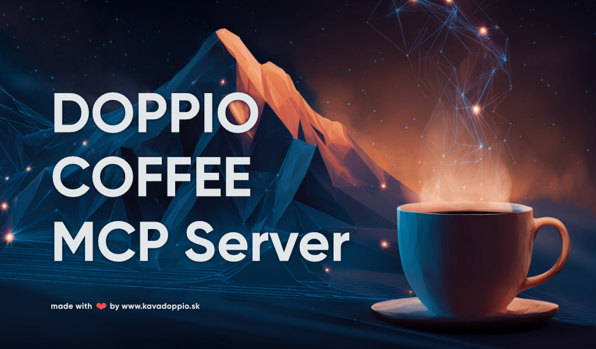

# ☕ Doppio Coffee MCP Server



**Order freshly roasted specialty coffee from DOPPIO roastery (Zilina, Slovakia) directly through AI assistants.**

[](https://opensource.org/licenses/MIT)

---

## Features

- **Browse Coffee Catalog** - Filter by origin, roast level, flavor notes, acidity, bitterness
- **Smart Recommendations** - Get suggestions based on your preferences
- **One-Click Ordering** - Create checkout with automatic 20% MCP discount
- **Save Preferences** - Remember your brewing method, favorite size, and shipping address
- **Slovak Roastery** - Fresh coffee from Zilina, shipped across Europe

---

## Quick Start

### Option 1: Download Bundle (Easiest)

1. Download `doppio-coffee-mcp.mjs` from [Releases](https://github.com/anthropics/doppio-coffee-mcp/releases)
2. Add to Claude Desktop config:

```json
{
  "mcpServers": {
    "doppio-coffee": {
      "command": "node",
      "args": ["/path/to/doppio-coffee-mcp.mjs"]
    }
  }
}
```

3. Restart Claude Desktop and start ordering coffee!

### Option 2: npx (Coming Soon)

```json
{
  "mcpServers": {
    "doppio-coffee": {
      "command": "npx",
      "args": ["doppio-coffee-mcp"]
    }
  }
}
```

### Option 3: Build from Source

```bash
git clone https://github.com/anthropics/doppio-coffee-mcp.git
cd doppio-coffee-mcp/mcp-server
npm install
npm run build
```

```json
{
  "mcpServers": {
    "doppio-coffee": {
      "command": "node",
      "args": ["/path/to/mcp-server/dist/index.js"]
    }
  }
}
```

---

## Available Tools

### `list_coffees`

Browse available coffees with powerful filtering.

| Parameter | Type | Description |
|-----------|------|-------------|
| `preparation` | `filter` \| `espresso` \| `omni` | Brewing method |
| `coffee_type` | `robusta` \| `arabica` \| `blend` \| `decaf` | Coffee type |
| `size` | `small` \| `medium` \| `large` | Package size |
| `origin` | string | Country (e.g., "Brazil", "Ethiopia") |
| `roast_level` | string | Roast level (Light, Medium, Dark) |
| `price_max` | number | Maximum price in EUR |
| `flavor` | string | Flavor note (chocolate, fruit, nuts...) |
| `altitude_min` | number | Minimum altitude in meters |
| `acidity_min` / `acidity_max` | 1-5 | Acidity level (higher = brighter) |
| `bitterness_min` / `bitterness_max` | 1-5 | Bitterness level (higher = more intense) |

**Example:** *"Show me Ethiopian coffees with fruity notes under 15 EUR"*

---

### `get_coffee_detail`

Get detailed information about a specific coffee including origin story, processing method, and tasting notes.

| Parameter | Type | Description |
|-----------|------|-------------|
| `coffee_id` | string | Coffee ID from catalog |

---

### `create_order`

Create an order with automatic **20% MCP discount**.

| Parameter | Type | Description |
|-----------|------|-------------|
| `items` | array | List of coffees to order |
| `items[].coffee_id` | string | Coffee ID |
| `items[].size` | `small` \| `medium` \| `large` | Package size |
| `items[].quantity` | number | Number of bags |
| `email` | string | Email for order (optional if saved) |

**Example:** *"Order 2 bags of large Dolce Vita"*

---

### `set_preferences`

Save your coffee preferences for faster ordering.

| Parameter | Type | Description |
|-----------|------|-------------|
| `preparation` | `filter` \| `espresso` \| `omni` | Your brewing method |
| `coffee_type` | string | Preferred coffee type |
| `default_size` | `small` \| `medium` \| `large` | Default package size |
| `email` | string | Email for orders |
| `shipping_address` | object | Your shipping address |

---

### `get_preferences`

Retrieve your saved preferences.

---

## Package Sizes

| Size | Weight | Best For |
|------|--------|----------|
| **small** | 220g (330g filter) | Trying new coffees |
| **medium** | 500g | Regular consumption |
| **large** | 1kg | Daily drinkers, offices |

---

## Example Conversations

**Browsing:**
> "What coffees do you have from Ethiopia?"
> "Show me something with chocolate notes, low acidity"
> "I want a light roast for filter brewing"

**Ordering:**
> "Order a large bag of Dolce Vita"
> "I'll take 2x medium Rwanda and 1x large Brazil"
> "Reorder my usual coffee"

**Preferences:**
> "I use an espresso machine, remember that"
> "My default size should be large"
> "Save my email as john@example.com"

---

## Development

```bash
# Install dependencies
npm install

# Build TypeScript
npm run build

# Watch mode (auto-rebuild)
npm run dev

# Run server
npm start
```

### Project Structure

```
mcp-server/
├── src/
│   ├── index.ts      # MCP server & tool definitions
│   ├── api.ts        # Backend API client
│   ├── preferences.ts # Local preferences storage
│   └── types.ts      # TypeScript interfaces
├── dist/             # Compiled JavaScript
└── package.json
```

---

## Support

For questions or issues:

- **Website:** [www.kavadoppio.sk](https://www.kavadoppio.sk)
- **Issues:** [GitHub Issues](https://github.com/your-repo/doppio-coffee-mcp/issues)

---

## License

MIT License - see [LICENSE](LICENSE) for details.

---

<p align="center">
  <b>DOPPIO Coffee</b> - Freshly roasted in Zilina, Slovakia 🇸🇰
</p>
